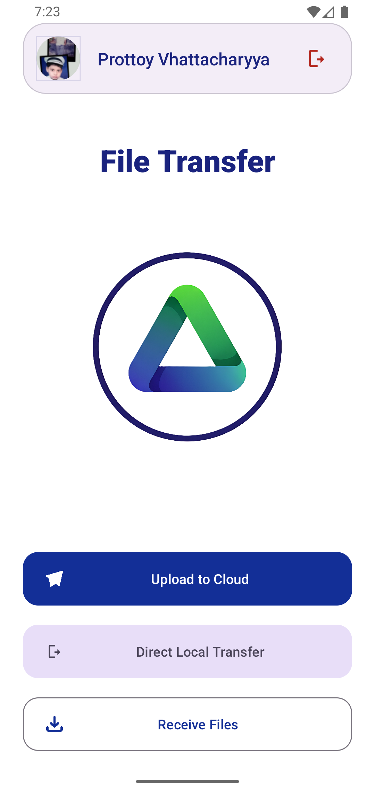
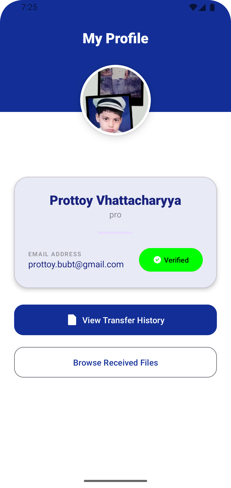

# File Share Android App

A file-sharing Android application that enables users to upload and share files through QR code scanning, built with Java and powered by Django REST API.

##  Features
- **User Authentication**: User can create account and login
- **Multiple file Upload and Download**: Upload files to database (4.5 MB max size for each file because of free vercel account)
- **QR Code Sharing**: Generate QR codes for file sharing - receivers can download files by simply scanning
- **Account Recovery and Verification**: User can reset or verify the account via OTP sent to email
- **Transfer History**: Automatically saves and displays user's send and receive history
- **File Veriication**: Verify  files before upload.


##  Tech Stack

- **Frontend**: Java (Android Native)
- **Backend**: Django REST Framework
- **Database**: MySQL
- Firebase Cloud Messaging

##  Prerequisites

Before running this project, ensure you have:

- Android Studio (latest version recommended)
- JDK 8 or higher
- Python 3.8+
- MySQL Server
- Firebase Console Account

#  Installation
Setup Backend Djano Server, MySQL, Firebase Cloude Messaging (for Notification) and the App's Server URL
## Backend Setup

- Open `api` folder in your IDE:

- **Database Setup:** Configure MySQL database in `dbconfig.py`:
```python
config = {
    'host': 'localhost',
    'user': 'root',
    'password': '',
    'port': '3306',
    'database': 'file_share_db'
}
```
- **Email Setup:** Web Search `goggle apppassword` and get your password
Configure Email in `api/ file_sharing_project/ settings.py`
```python
EMAIL_HOST_USER = "your gmail"
EMAIL_HOST_PASSWORD = "your password"
```
- **Setup FCM Admin:** Goto [Firebase Console](https://console.firebase.google.com/) -> `create new project` -> `Service Accounts` -> Select `Python` -> `Generate New Private Key`
- new json file will be downloaded.
- rename to `firebase_credentials.json`
- Save it to `api/Services/Firebase/firebase_credentials.json`


- **Start** the Django server inside `api` folder:
```bash
pip install uv
```
```bash
python -m uv run manage.py runserver 0.0.0.0:8000
```
UV will download all the dependencies and start the server


> [!TIP]
> If terminal shows this when you first run the server, then the server started successfully.

```bash
Database tables created successfully.
Firebase initialized successfully.
... ...
```


## Android App Setup

### setup Server URL
- Open the `app` folder in Android Studio

- Update the API base URL in the app configuration (`app/res/values/strings.xml`):
```java
// In res/values/strings.xml file
<string name="server_url">your_server_ip:8000</string>
```
- If you are using `http` url, then add it here. 
```java
// In res/xml/network_security_config.xml file
<domain includeSubdomains="true">123.123.123.123</domain> 
```

### setup FCM (To Send Notifications)
- Goto `Android Studio` -> `Tools` (in the top) -> `Firebase` -> `Connect to Firebase` -> `Cloud Messaging` -> `connect the app`
- google-services.json folder will be added in your app folder.

> [!TIP]
> If you are confused, Search `How to connect Android Studio with Firebase` on Youtube

- Sync Gradle files and build the project

- Run the app on your device or emulator


##  Screenshots
  

  

> [!IMPORTANT]
> If you found this project helpful, please give it a star!

## 📞 Support

For support, email prottoyvhattacharyya@gmail.com or open an issue in the repository.
